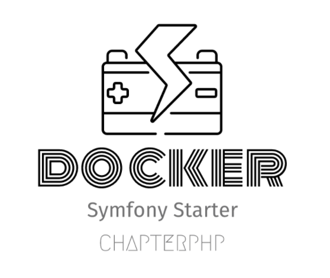

<div align="center">
    
    <h1 style="font-weight: bolder; margin-top: 0px" class="opacity-75">Symfony Docker Starter</h1>
</div>

<div align="center">
  <p>Symfony 5.4 + Nginx + PHP-FPM + Docker Alpine </p>

  <p>
    <a href="#">
      
    </a>
    <a href="#">
      
    </a>
  </p>
  
</div>

---

## Starting started 
read the official documentation to learn how to install symfony <https://symfony.com/download>.
> `make init` is going to initialize an application with symfony 5.4. Be sure that you have already started `Proxifier` 
> client.
```
cd symfony-docker-start
make init
make start
```

## Localhost URL

go to [http://localhost](http://localhost)

## licence
[apache-2.0](https://choosealicense.com/licenses/apache-2.0/)

## Maintainer
[xun.zhou@mail.schwarz](https://vikbert.github.io/)
